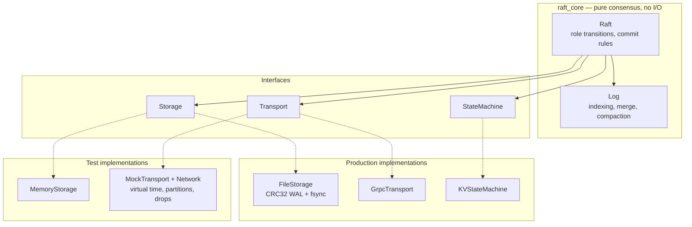
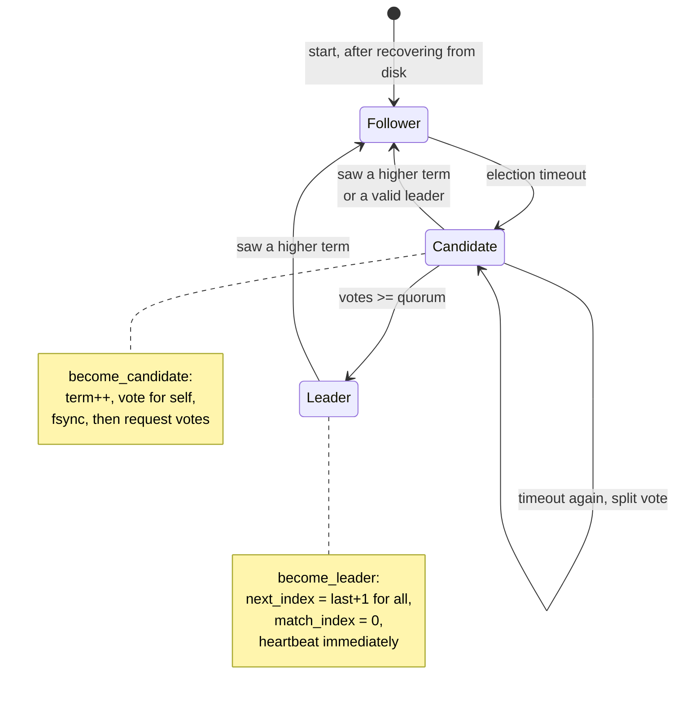
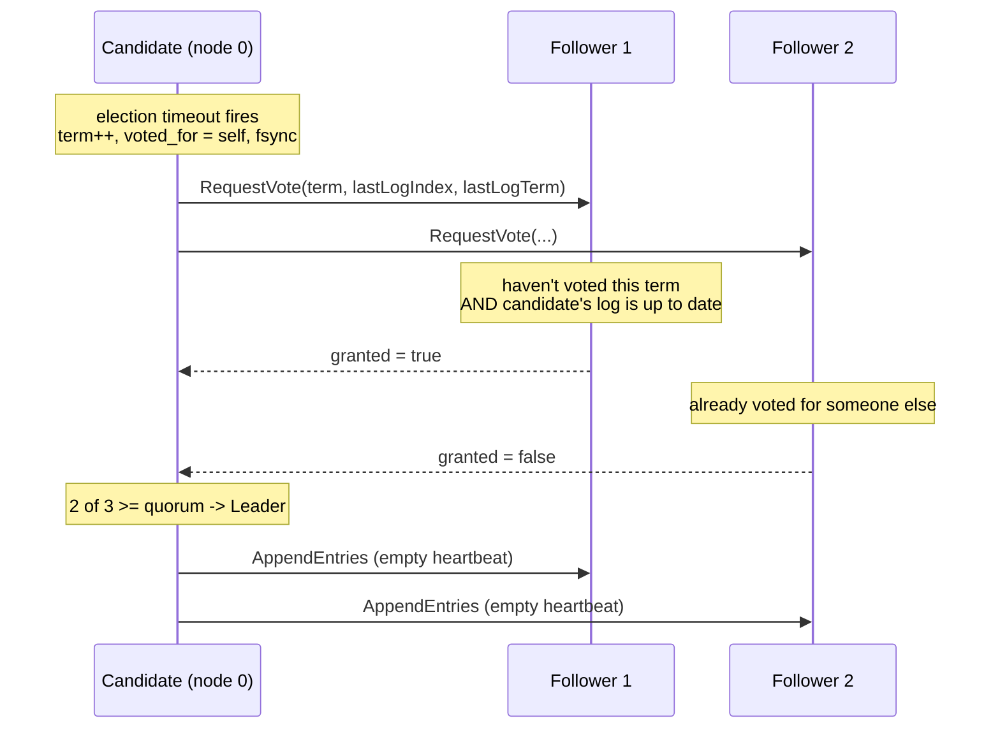
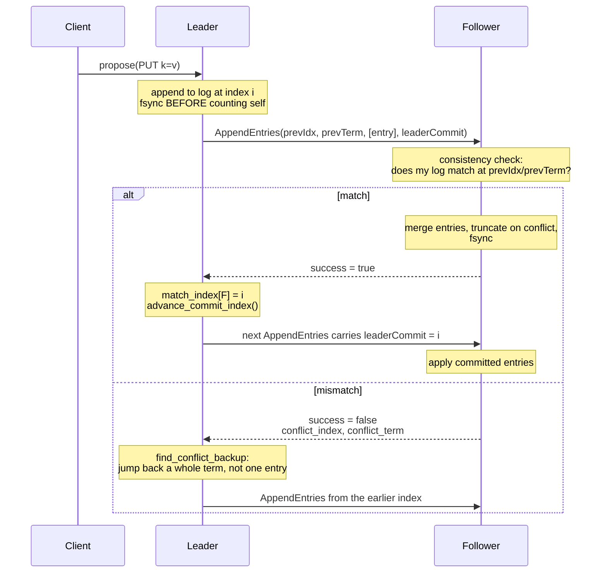
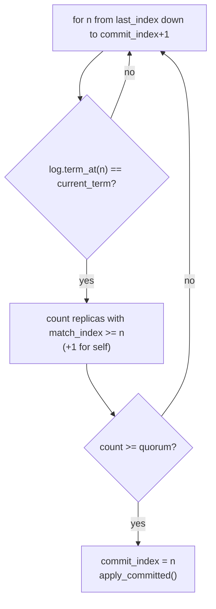
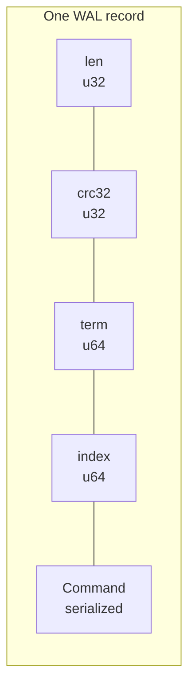
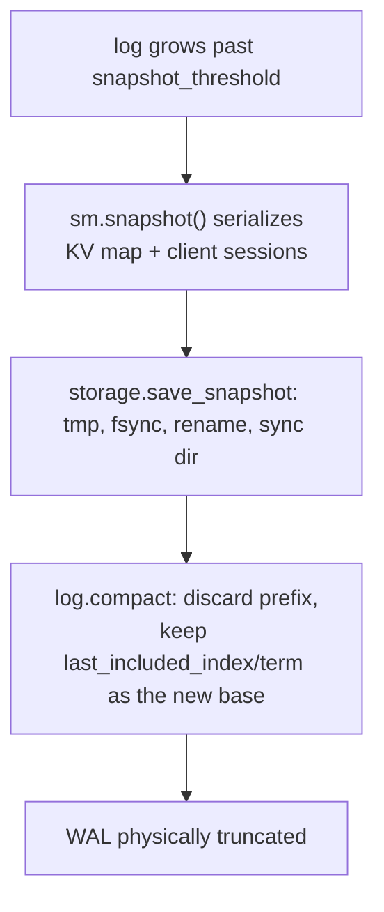

# raftkv

A Raft consensus implementation in C++20 with a replicated key–value state machine,
a crash-safe write-ahead log, log compaction via snapshots, and a gRPC transport.

The design goal is a **testable** Raft: the consensus core has no networking, no
threads, and no clock of its own. Everything it touches — storage, transport, the
state machine, and time — arrives through an interface, so the entire protocol can
be driven deterministically in a simulated network.

---

## Status

| Area | State |
|---|---|
| Consensus core (`raft_core`) | Implemented; 17/17 unit tests pass, clean under ASan/UBSan |
| Durable WAL + torn-write recovery | Implemented and tested |
| Snapshots / log compaction | Implemented; not covered by tests |
| gRPC transport | Implemented; not covered by tests |
| `raftkv-server` | **Config is hardcoded — does not parse its CLI flags** |
| `chaos/partition.py` | Cannot work until the server parses flags |

There is one **known safety bug** that lets a minority node win an election.
See [Known issues](#known-issues) before using this for anything real.

---

## Repository layout

```
include/raftkv/     Public headers. Log, storage, transport, state machine, types.
  types.hpp           Command, LogEntry, Role, serialization primitives
  log.hpp             The replicated log: indexing, merge, compaction, conflict search
  rpc.hpp             Plain-struct RPC payloads (no protobuf dependency)
  storage.hpp         Storage interface + MemoryStorage + make_file_storage factory
  transport.hpp       Transport interface + the deterministic Network simulator
  state_machine.hpp   StateMachine interface + KVStateMachine with client sessions
  raft.hpp            Config, ProposeResult, and the Raft class

src/raft/           The consensus core, split by concern
  raft.cpp            Construction, role transitions, commit/apply, propose
  election.cpp        Election timeout and RequestVote handling
  replication.cpp     Heartbeats, AppendEntries send/handle, conflict repair
  snapshot.cpp        InstallSnapshot handling

src/storage/
  wal.cpp             FileStorage: CRC32 WAL, fsync, atomic rename, recovery
  snapshot_store.cpp  Standalone snapshot writer (currently unused — see Known issues)

src/transport/
  grpc_transport.cpp  Real network transport over gRPC

src/server/main.cpp   Single-threaded event loop wiring Raft to gRPC
client/kvcli.cpp      CLI client with leader-redirect following
bench/throughput.cpp  Throughput benchmark
chaos/partition.py    Process-level chaos harness
proto/raft.proto      Wire schema for both the Raft and KV services
tests/                GoogleTest suites
```

---

## Architecture

The core depends only on interfaces. The arrows point from consumer to abstraction,
which is what makes both the real server and the simulated test cluster possible
without changing a line of consensus code.



`Raft` never creates a thread and never reads a clock. Timers are *inputs*:
the owner calls `on_election_timeout()` and `on_heartbeat_tick()`. In production
that owner is the event loop in `src/server/main.cpp`; in tests it is a `for` loop
over virtual milliseconds.

---

## Building and running the tests

The unit tests need only `raft_core` and GoogleTest. gRPC is required solely for the
server, CLI, and benchmark, and it is a large source build — so it is behind a flag:

```bash
cmake -S . -B build -DCMAKE_BUILD_TYPE=Release -DRAFTKV_BUILD_GRPC=OFF
cmake --build build -j$(nproc)
ctest --test-dir build --output-on-failure
```

That configures in seconds and runs the full suite in about three seconds.

To build the server, CLI, and benchmark as well, drop the flag (it defaults to `ON`).
This fetches and builds gRPC v1.62.0 from source, which needs several GB of disk and
a long first build:

```bash
cmake -S . -B build -DCMAKE_BUILD_TYPE=Release
cmake --build build -j$(nproc)
```

Run a single test or suite directly:

```bash
./build/unit_tests --gtest_filter='Election.*'
./build/unit_tests --gtest_list_tests
```

---

## Core concepts

**Term** — a logical clock (`uint64_t`). It increases monotonically and only ever
goes up. Every RPC carries a term; seeing a higher one forces an immediate step-down
to follower. This single rule is what makes stale leaders harmless.

**Log index** — a 1-based position. Index `0` means "empty", which lets consistency
checks avoid special cases.

**The Log Matching invariant** — if two logs hold an entry with the same index *and*
term, then the entries are identical and every preceding entry matches. All of
replication is built on maintaining this.

**Quorum** — `cluster.size() / 2 + 1`. Three of five, two of three.

**Committed vs applied** — an entry is *committed* once it is durable on a quorum;
it is *applied* once it has been handed to the state machine. `commit_index` and
`last_applied` are both volatile and rebuilt after a restart.

---

## Roles and elections



A candidate increments its term, votes for itself, and **persists that vote before
sending a single RPC**. Order matters: replying to a vote request or counting your
own vote before the term hits the disk means a crash-and-restart could vote twice in
one term and elect two leaders.



### The election restriction

A vote is granted only if the candidate's log is **at least as up to date** as the
voter's — Raft §5.4.1, in `Raft::log_is_up_to_date`:

```
later term wins;  equal term -> longer log wins
```

This is the rule that guarantees a leader already holds every committed entry, so a
newly elected leader never has to fetch missing history. Weakening it would let a
node with a stale log win and silently erase committed writes.

### Randomized timeouts

Nothing breaks a tie except randomness. If every node's election timer expires on the
same tick, all of them become candidates in the same term, every vote splits, and the
cluster livelocks — no leader, forever. The `Config` carries `election_min`/
`election_max` for exactly this, and **the owner of the timer is responsible for
drawing from that range**. `Raft::reset_election_timer()` is deliberately an empty
stub, because the core does not own the clock.

---

## Log replication

The leader tracks two indices per follower:

- `next_index[p]` — the next entry to send. Optimistic; starts at `last_index + 1`.
- `match_index[p]` — the highest entry known replicated. Pessimistic; starts at `0`.



### Fast conflict backup

Decrementing `next_index` by one per round trip costs one RPC per divergent entry.
Instead the follower reports *why* it rejected:

| Situation | `conflict_index` | `conflict_term` |
|---|---|---|
| Log too short | follower's `last_index + 1` | `0` |
| Term mismatch at `prev_log_index` | first index of the follower's conflicting term | that term |

The leader then calls `Log::find_conflict_backup`, which scans for the last entry it
holds in `conflict_term` and resumes just past it — skipping an entire divergent term
in a single round trip.

### The commit rule



The `term_at(n) == current_term` guard is subtle and load-bearing. A leader may
**not** commit an entry from a previous term merely because it is now stored on a
majority — that entry can still be overwritten by a future leader. It becomes
committed only indirectly, once an entry from the *current* term commits above it.
`Replication.DoesNotCommitPastTermEntriesByCountAlone` pins this behaviour.

---

## Durability

`FileStorage` (in `src/storage/wal.cpp`) keeps three files per node:

```
<data_dir>/wal.log         append-only, CRC32 per record
<data_dir>/hardstate.bin   current_term + voted_for
<data_dir>/snapshot.bin    last_included_index/term + state machine bytes
```

### WAL record format



The CRC covers the payload only. `Command::serialize` writes a 1-byte op, `client_id`
and `seq_no` as u64s, then length-prefixed `key`, `value`, and `expected` — all
little-endian, so the encoding is byte-identical on every replica.

### Crash safety rules

1. **fsync before acknowledging.** A leader fsyncs a new entry before counting
   itself toward the quorum; a follower fsyncs before replying `success`. Batched
   appends pay a single fsync for the whole batch.
2. **Atomic replace for whole-file state.** `hardstate.bin` and `snapshot.bin` are
   written to `.tmp`, fsynced, renamed, and then the *directory* is fsynced — without
   that last step the rename itself can be lost in a power cut.
3. **Torn tail recovery.** Recovery walks the WAL record by record. A short read or a
   CRC mismatch ends the scan, and the file is `ftruncate`d back to the last
   byte that verified. A half-written record left by a power cut is discarded rather
   than crashing the node. `PersistenceTest.TornTrailingRecordIsDiscarded` injects
   exactly this.

### What is *not* durable

`commit_index`, `last_applied`, and the state machine itself are volatile by design.
After a restart a node replays from `snapshot.bin`, rebuilds its log tail from the
WAL, and then waits for a leader to tell it the commit index before applying
anything. A recovered node is briefly a node with all the data and none of the
conclusions — which is why `PersistenceTest.NoAcknowledgedWriteLostOnLeaderKill` has
to let the revived node rejoin before it can observe its own committed write.

---

## Snapshots and compaction

Once `last_applied` runs `snapshot_threshold` entries past the log's base, the node
serializes the state machine, writes it durably, and drops the covered prefix.



A follower that has fallen behind the leader's log base cannot be repaired by
`AppendEntries` — the entries it needs no longer exist. The leader detects this
(`next_index[p] <= first_index - 1`) and sends `InstallSnapshot` instead.

On receipt the follower checks whether it holds a matching entry at the snapshot
boundary. If so it compacts and **keeps its uncommitted tail**; if not, its history
has diverged and the whole log is discarded and rebased on the snapshot.

`KVStateMachine` deliberately uses `std::map`, not `std::unordered_map`: iteration
order must be identical on every replica, or two nodes snapshotting the same logical
state would produce different bytes.

---

## Linearizability and client sessions

Committing a command once is not enough. A client whose request times out will retry,
and a naive log would apply the same `PUT` — or worse, the same `CAS` — twice.

Every `Command` carries a `client_id` and a monotonic `seq_no`. `KVStateMachine`
keeps a per-client session holding the last sequence number and its result:

- `seq_no` **equals** the cached one → return the cached result, do not re-execute
- `seq_no` **below** the cached one → reject as stale
- `seq_no` **above** → execute, then cache

Sessions are part of the snapshot, so exactly-once survives compaction and restarts.

This is what makes retries safe at the Raft level too: a client may propose the same
command to several leaders across a partition, and duplicate entries may legitimately
land in the log — but the state machine applies the effect exactly once.

---

## Tests

```bash
ctest --test-dir build --output-on-failure
```

| Suite | Covers |
|---|---|
| `Election` | One leader per term; re-election after crash; a lone node never wins; step-down on higher term; the §5.4.1 up-to-date restriction |
| `Replication` | Commit reaching all replicas; quorum sufficiency; no commit without quorum; repair of a divergent follower; the past-term commit rule |
| `PersistenceTest` | HardState and entries surviving restart; torn-tail discard; suffix truncation; no acknowledged write lost when the leader is killed and revived |
| `Linearizability` | The checker rejects a known-bad history; real histories under partitions are linearizable |

### The simulator

`Network` in `include/raftkv/transport.hpp` is a deterministic virtual-time network.
Messages are closures in a `multimap` keyed by due-time; `step()` advances the clock
and runs whatever is due. It offers `partition()`, `heal()`, `set_drop_rate()`,
`set_latency()`, and `detach()` for simulating a node going down.

Partitions are re-checked at **delivery** time, not send time, so a message in flight
when the network splits is dropped — which is how a real network behaves and where
the interesting bugs live.

Every RNG is fixed-seed, so a failure reproduces exactly.

Two rules the harness must respect, both learned the hard way:

- **Randomize each node's election deadline independently.** Firing them all on one
  tick guarantees a split vote every round and the cluster never elects anyone.
- **`detach()` a node before destroying it.** Its RPC handlers capture a pointer to
  the `Raft` instance; leaving them registered means in-flight messages call into
  freed memory.

---

## Known issues

### 1. A minority node can win an election (safety bug)

`Raft::on_election_timeout` calls `become_candidate()`, which **already** broadcasts
`RequestVote` to every peer, and then broadcasts a **second** round itself. Each reply
runs a callback that does `votes_received_++`, so a single peer's grant is counted
twice.

The consequence is not cosmetic. In a 5-node cluster partitioned `{0,1} | {2,3,4}`,
node 0 can reach only node 1 — two real votes against a quorum of three — yet it
becomes leader:

```
node0 role=Leader   (quorum needs 3 of 5; only 2 reachable)
```

Both sides of the partition can therefore hold a leader in the same term, which is
split brain and can lose committed writes. The fix is to delete the duplicate
broadcast in `src/raft/election.cpp` so `become_candidate()` is the only sender.

The existing tests do not catch it because they use 3-node clusters where the inflated
count happens to coincide with a genuine majority.

### 2. `raftkv-server` ignores its command line

`src/server/main.cpp` documents `--id`, `--peers`, and `--data`, and its signature
takes `argc`/`argv`, but it never reads them. `self_id`, the peer address map, and the
data directory are all hardcoded, so every process launched from this binary believes
it is node 0 and writes to `./data/n0`.

`chaos/partition.py` passes those exact flags, so the chaos harness cannot bring up a
real cluster until the parsing is implemented.

### 3. No randomized election timeout in production

The event loop in `main.cpp` uses a fixed `cfg.election_max` for every node, with a
comment noting randomization is "assumed in reality". As described above, identical
timeouts across nodes are precisely the condition that livelocks elections. The
`Config` already carries the range; the loop needs to draw from it.

### 4. `snapshot_store.cpp` is dead and inconsistent

It compiles into `raft_core` and exports `write_snapshot_atomic`/`read_snapshot`, but
nothing calls them — `FileStorage` implements snapshot persistence inline. The two
formats also disagree: `snapshot_store.cpp` writes a 24-byte header of three `u64`s,
while `wal.cpp` writes and reads a 20-byte header of `u64, u64, u32`. Wiring the two
together without reconciling the header would corrupt snapshots.

### 5. Untested subsystems

Snapshotting, `InstallSnapshot`, and the gRPC transport have no test coverage. The
snapshot code paths in particular are the most intricate in the codebase — divergent
log detection, rebasing, and session preservation across compaction — and are
currently unverified.

---

## License

None specified.
